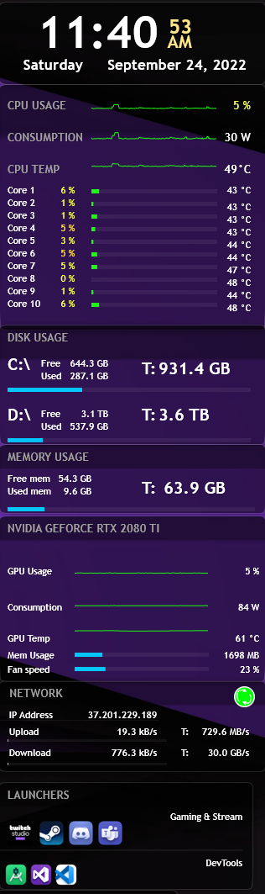
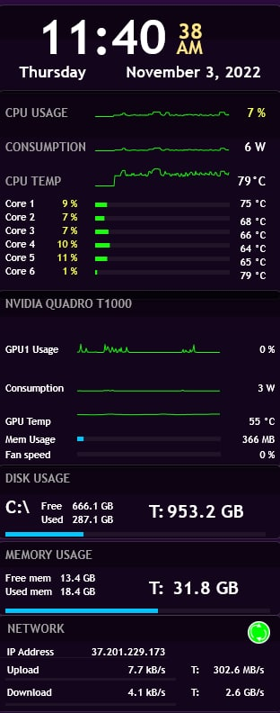

# Rainmeter Skin: rainru

Desktop monitoring system using Rainmeter and MSIAfterburner

 

 
## 1.1. __*rainru*__ showcase

 

<table>
    <tr>
        <th>Test PC 1</th>
        <th>Test PC 2</th>
    </tr>
    <tr>
        <td>
            
        </td>
        <td>
            
        </td>
    </tr>
</table>

 

## 1.2. Requirements
 * A Windows PC
 * Rainmeter software

 * MSIAfterburner software + MSIAfterburner.dll plugin

 * and the __*rainru*__ skin.

  

## 1.3. Installation

Installation steps are further explained in my [Wiki](../../../rainmeter-skin/wiki)
